# INSLIB

[](https://github.com/jnz/INSLIB/actions/workflows/ci.yml)
[](https://codecov.io/gh/jnz/INSLIB)


> A portable C library for 3D navigation state estimation. Mail: jan.zwiener@h-da.de

In action, fusing IMU measurements with Galileo HAS-corrected GPS/GNSS inputs:

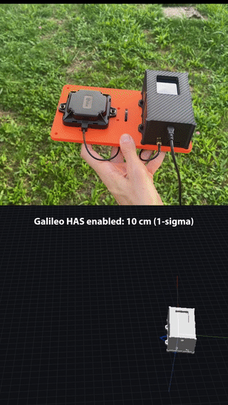

<!-- COVERAGE:START -->
**Test coverage** of the core library (`src/`):

| Metric | Coverage |
|---|---|
| C0 (Line) | 99.8% (3940/3946) |
| C1 (Branch) | 92.3% (2625/2843) |
| MC/DC | 92.3% (2604/2822) |
<!-- COVERAGE:END -->

<!-- STACK:START -->
**Worst-case stack usage** in bytes, deepest call chain including KFCore and the C library, from static analysis (`make stack`):

| Entry point | x86_64-linux-gnu, GCC 14.2.0 |
|---|---:|
| `nav_suite_update()` | 12864 |
| `ins_update()` | 11840 |
| `ahrs_update()` | 8240 |
| `baro_alt_update()` | 7904 |
| `nav_suite_init()` | 2704 |
| `ins_init()` | 2688 |
<!-- STACK:END -->

## Example Video


*Example video of pure inertial tracking with a TDK ICM-45686 low-cost Inertial Measurement Unit (IMU)*

## Overview

INSLIB is a portable C library for 3D navigation state estimation.  Its core is
a set of Kalman filters fusing measurements from an inertial
measurement unit (IMU) with GNSS/GPS measurements, barometer, magnetometer,
local position references, absolute yaw references, scalar ground speed and
zero-velocity / zero-rotation information.

**Typical use cases:**
* Drones (UAVs) and autonomous vehicles
* Robotics platforms
* Aerospace
* Cars
* Embedded systems requiring precise tracking
* Post-processing of recorded flights or driving data

The core library is written in pure **C** (C11), has no external dependencies
and is optimized for embedded microcontrollers.  A useful collection of Python
helper programs and GUI apps are included in this repository.

## Features

* `>90% Test Coverage` including **MC/DC** testing (also used in aerospace **DO-178 DAL-A** or **ISO26262 ASIL-D** developments)
* **Requirements traceability**: code logic is linked to a machine-checked [requirements database](requirements/) (`make reqs`), aerospace-style
* Battle tested heavily with real world data and edge cases
* Measurement delay compensation and estimation (e.g. GNSS/GPS receivers typically have more than 100-200 milliseconds of latency due to processing, internal filtering, UART transmission, etc.)
* Suited for UAVs: during a GNSS outage the filter keeps providing an inertial-fused altitude (via the parallel `baro_alt` vertical channel) and full attitude, not just raw IMU integration
* UAVs that only need roll/pitch, no yaw/heading, can skip the magnetometer entirely: the standalone `AHRS_MODE_ARS` mode (5-state, freely-integrated yaw) runs from IMU data alone
* Robust UDU/Bierman-Thornton Kalman Filter routines for numerically robust square-root filtering (effective precision for covariance is increased)
* Worst-Case-Execution Time (WCET) friendly: no unbounded loops, recursion, suitable for real-time control loops
* **Bounded, known stack usage**: static worst-case stack analysis of every public API function (`make stack`, built on GCC's `-fcallgraph-info`), gated against budgets and failing on recursion, variable length arrays or unresolved function pointer calls, so the stack of the task running the filter can be sized from a number instead of a guess
* Strong static code analysis tests (undefined behaviour sanitizer **UBSan, ASan**)
* Built-in light-weight World Magnetic Model (WMM) for magnetometer declination compensation
* No heap, no OS dependencies, portable code: runs on bare-metal **embedded** targets as well as on a desktop computer
* 32-bit float (IEEE 754) for most calculations (except for GNSS/GPS coordinates), no 64-bit double precision hardware floating point unit (FPU) required
* Calibration tools included to calibrate sensor bias, scale, and misalignment without expensive calibration hardware (Tedaldi et al., ICRA 2014)


## Library Architecture Block Diagram

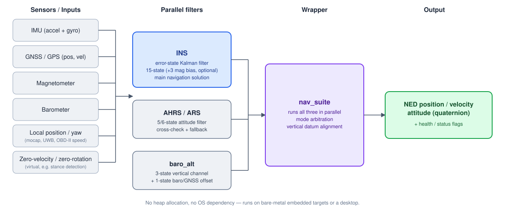

## Post Processing Quickstart

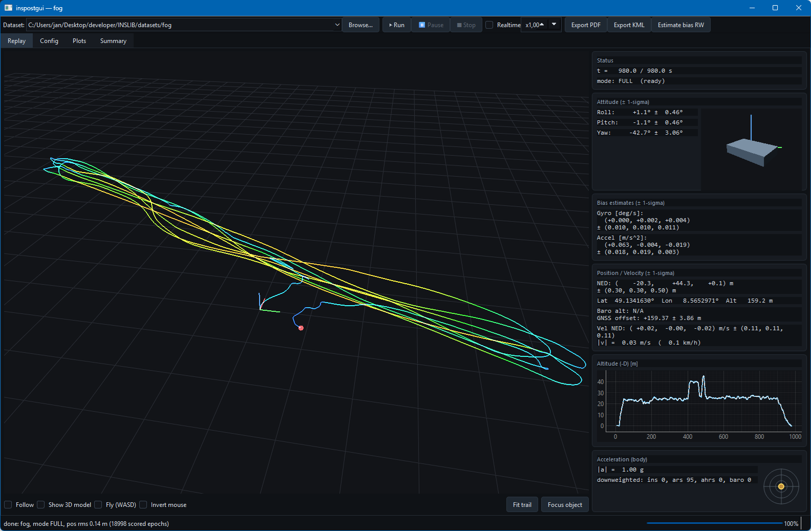

`inspostgui.py` is a GUI to post-process measurements: pick a dataset directory
(CSVs + `config.yaml`), tweak its settings, and replay it.

```sh
sh python/setup_venv.sh               # one-time (also runs `make pylib`)
. env.sh                              # activate the venv (POSIX/git-bash, any OS)
python3 python/inspostgui.py datasets/fog
```

### `.csv` Data Format

The input format is plain CSV, one file per sensor. First item is a common
`t_us` timestamp in microseconds. IMU example:

```text
# t_us, gyr_frd_x [rad/s], gyr_frd_y [rad/s], gyr_frd_z [rad/s], acc_frd_x [m/s^2], acc_frd_y [m/s^2], acc_frd_z [m/s^2]
0,-0.0016361766,-1.39143679e-08,-0.000272652038,-0.114920214,0.191539065,-9.84495283
50003,-0.0016361766,-1.39143679e-08,-0.000272652038,-0.114920214,0.191539065,-9.84495283
100005,-0.000272652038,-0.000272707696,0.000818123087,-0.0861961461,0.248990132,-9.7587816
```

GNSS/magnetometer/barometer/speed `.csv` files follow the same pattern. Example files:

* [IMU example](doc/example_imu.csv)
* [Barometer example](datasets/crazyflie/dead_reckoning/baro.csv)
* [GNSS example](datasets/tunnel/gnss.csv)
* [Magnetometer example](datasets/pedestrian/07_outdoor_only/mag.csv)
* [Wheel speed (odometry) example](datasets/tunnel_odometry/speed.csv)

### `config.yaml`

A dataset directory with CSV files contains one `config.yaml` that
tells the filter how to run: aiding mode, sensor noise, lever arms, which
channels are enabled. Two examples to start from:
[doc/example_conf/config_basic.yaml](doc/example_conf/config_basic.yaml)
(GNSS+IMU+baro+mag) and
[doc/example_conf/config_local_inertial.yaml](doc/example_conf/config_local_inertial.yaml)
(GNSS-free, pure inertial dead-reckoning). The keys are documented in
[doc/INSLIB_manual.pdf](doc/INSLIB_manual.pdf), section "Dataset
configuration: config.yaml".

### `replay.py` Command Line Post-Processing Version

`replay.py` is the command line version of the `inspostgui.py` Python GUI above.

```sh
sh python/setup_venv.sh               # one-time (also runs `make pylib`)
. env.sh                              # activate the venv (POSIX/git-bash, any OS)
python3 python/replay.py datasets/fog --plot --plot-out /tmp/plots.pdf
```

Example PDF plot output from `replay.py`:

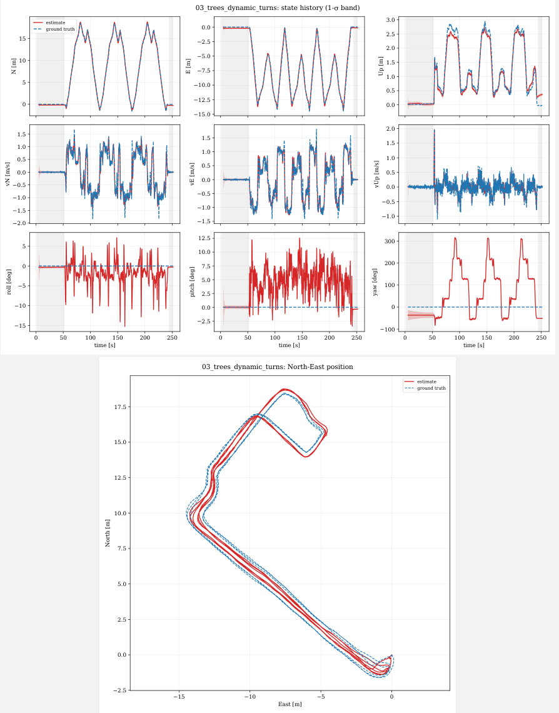

Google Earth `.kml` output is also possible with `--kml output.kml`.
Info: The Google Earth web version does not support track animations (yet?).

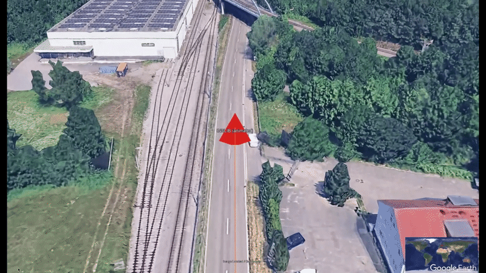

## GNSS Latency Estimation

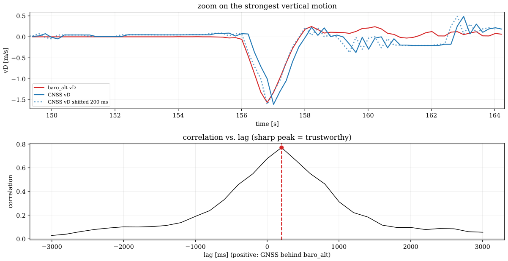

GNSS receivers report data with some latency
(transmission, internal processing, filtering) but
receiver and configuration dependent. `inspostgui.py` and `replay.py` measure
the real value for a specific configuration: IMU + barometric altitude has near-zero
latency, cross-correlating its vertical velocity against the
GNSS-reported vertical velocity around a real climb/descent results in a lag
with a sharp correlation peak (see the plot above).

Example for a u-blox X20P receiver delay estimation:
```sh
python3 python/replay.py datasets/pedestrian/07_outdoor_only/ --estimate-gnss-delay
```

## Live Data Quickstart

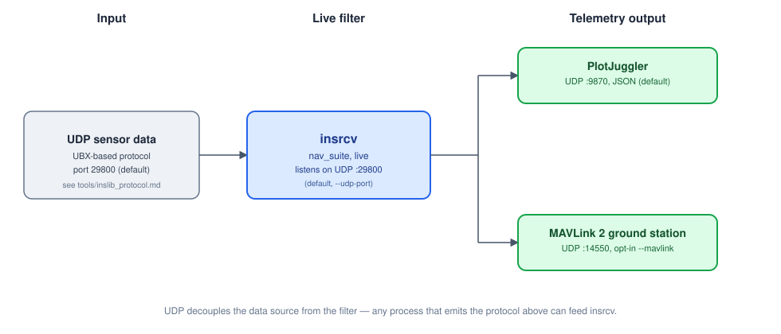

`insrcv` listens for UDP packets with sensor measurements. The packet
format is documented in [tools/inslib_protocol.md](tools/inslib_protocol.md).
Any process that sends this protocol format can feed it on UDP port `29800`
(default). Output goes to PlotJuggler (UDP `:9870`, JSON) and optionally in
MAVLink format (UDP `:14550`).

```sh
make insrcv
./build/insrcv --mavlink   # run and wait for UDP sensor input
```

## Tutorials

* [tutorial/c_tutorial.md](tutorial/c_tutorial.md): use the library from **C/C++**: a full example
* [tutorial/python_tutorial.md](tutorial/python_tutorial.md): the filter from Python in a few lines, including installation
* [doc/INSLIB_manual.pdf](doc/INSLIB_manual.pdf): documentation, including filter design and math background

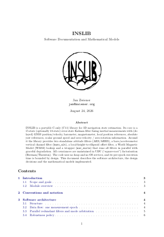

## GNSS inputs

* Galileo High Accuracy Service (HAS) support from e.g. u-blox X20-series for `<10 cm` horizontal accuracy (1-sigma) without a correction service (requires compatible antenna)
* u-blox SPARTN/PointPerfect Flex (commercial) correction stream supported for `3-6 cm` accuracy and convergence in seconds (source: [u-blox](https://www.u-blox.com/en/product/pointperfectflex))
* RTK via NTRIP RTCM corrections for `1 cm` accuracy, from your own GNSS base station, a virtual base station, or a regional service such as SAPOS

## Supported sensors

* Inertial Measurement Units (IMU): Accelerometer, Gyroscope
* GNSS/GPS Receivers (e.g. u-blox X20, F9P, etc.)
* GNSS Dual Antenna Compass Systems
* Magnetometers
* Barometers
* Local motion capture systems (mocap, like Lighthouse)
* OBDII Odometry Reader
* Virtual zero velocity (ZUPT), zero rotation rate (ZARU) sensors

## Real world data sets

* [UAV data](datasets/crazyflie): Crazyflie 2.1 Brushless UAV with accurate ground truth from Lighthouse mocap system
* [Rotorcraft](datasets/fog): MEMS vs. FOG (Fiber Optic Gyro reference) INS comparision while airborne in a rotorcraft
* [Car](datasets/tunnel): data with e.g. GNSS outages from a road tunnel or degraded satellite visibility in urban canyons
* [Car with wheel speed](datasets/tunnel_odometry): a road tunnel GNSS outage bridged with OBD2 odometry
* [Pedestrian](datasets/pedestrian): Handheld walking trials
* [ArduPilot](datasets/pedestrian/06_outdoor_to_indoor): comparison with ArduPilot EKF3 solution from the same measurements
* [kfgins](datasets/kfgins): comparison with navigation solution library from Wuhan University (i2Nav group)
* [Paul Groves book](datasets/simulated/profile_1_car): comparison with solution from Paul Groves book MATLAB example code
* [MATLAB Navigation Toolbox](datasets/simulated/B_drone): comparison with solution from MATLAB's Navigation Toolbox

*(Not all datasets have an absolute ground truth available, e.g. the ArduPilot dataset is comparing the INSLIB solution with the ArduPilot solution)*

## Setup

This repository uses the `KFCore` git submodule. Clone it recursively:

```sh
git clone --recursive <repo-url>
```

If you already cloned without `--recursive`, fetch the submodule with:

```sh
git submodule update --init --recursive
```

The core C library only needs a C11 compiler and `make` (see Quickstart
above). The Python bindings, plotting and reference-board tools additionally
need a virtual environment:

```sh
sh python/setup_venv.sh      # one-time (Windows: python\setup_venv.bat)
. env.sh                     # activate the venv (POSIX/git-bash, any OS)
```

`make check-all` (see `coding_style.md`) additionally wants `clang-format`,
`cppcheck`, `clang-tidy`, `lcov` and `doxygen`. Their exact versions matter
for `make format-check` in particular; on a non-Ubuntu-22.04 machine, run
`scripts/fetch_ci_clang_format.sh` once to match CI bit-for-bit.

## Directory Structure

```text
📂 inslib/
├── Makefile              # Build: make test, make insrcv, ...
├── src/                  # Core library (.c/.h), no heap, no OS dependencies
│   └── nav_suite.h       # Main header: INS + AHRS + baro_alt wrapper
├── KFCore/               # Submodule: linear algebra, UDU/Bierman-Thornton filter
├── tests/                # Unit/integration tests
├── datasets/             # Real-world + simulated replay datasets
├── tools/                # C/Python reference board tools: calibration, GUI
├── python/               # Python bindings, plotting, replay harness
├── magneticmodel/        # WMM lookup table
├── doc/                  # Documentation, Doxygen, images
└── tutorial/             # Minimal C + Python usage examples
```

## Reference Hardware

All tools (`tools/`) speak an open (UBX-based) protocol,
documented in [tools/inslib_protocol.md](tools/inslib_protocol.md).

The *reference board* is a low-cost and ready-to-use development module (IMU,
u-blox GNSS receiver, magnetometer, barometer) for running INSLIB on real
hardware with pre-calibrated sensors.  It implements the protocol above and is
ready to use out of the box. Its firmware itself is not public, get in touch if
you're interested in a collaboration with my university institute or in getting a unit.

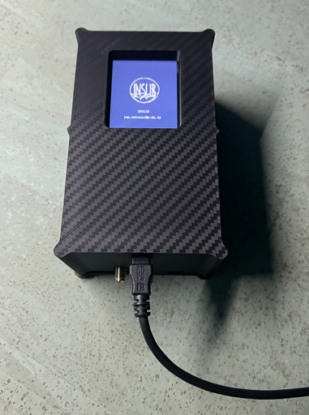

Building your own sensor suite is also possible, an example conf (mid 2026 sensor landscape):

| Sensor | Example part | Notes |
|---|---|---|
| IMU | TDK InvenSense ICM-45686, Bosch BMI563/BMI570, Analog Devices ADIS16505 or Murata SCH16T-K10 | |
| Magnetometer | MEMSIC MMC5603NJ or ST LIS3MDL | |
| Barometer | Bosch BMP581 or TE MS5611 | |
| GNSS receiver | u-blox F9P or X20 | X20-series has L1/L2/L5 support and Galileo HAS decoding |

### Reference Board Calibration GUI

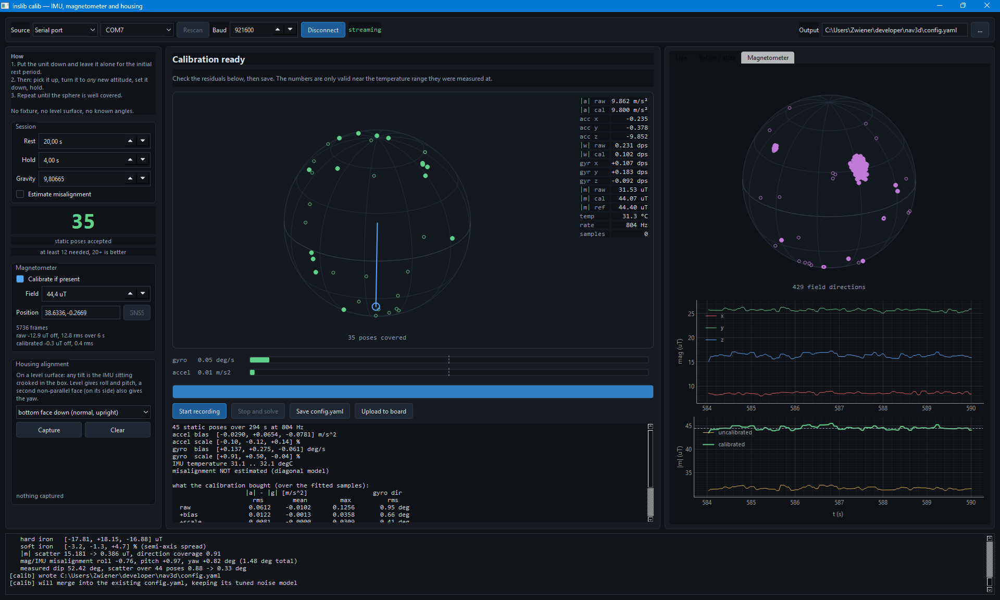

IMU/Magnetometer-Calibration + Housing-Alignment, user-friendly GUI for the
reference board.  The GUI allows an easy calibration of the sensor hardware for
bias, scale and misalignment **without** the need for an expensive calibration
environment like robotic arms, except for a controlled temperature environment.
The sensor must be placed still for a few seconds in a variety of different orientations on a stable
surface:

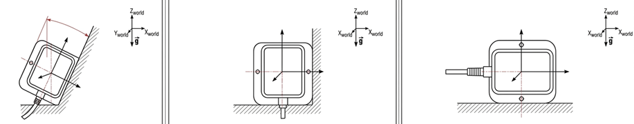

### Sensor Management GUI

Live-Control center for reference INS board

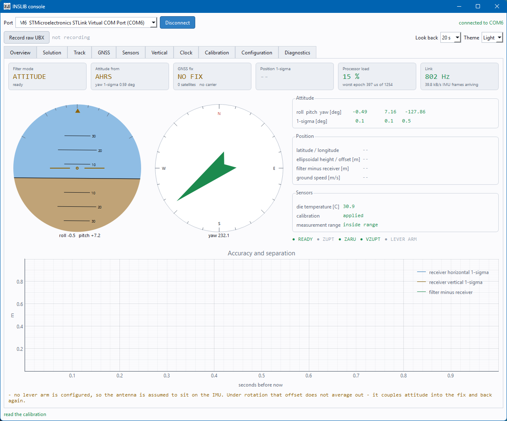

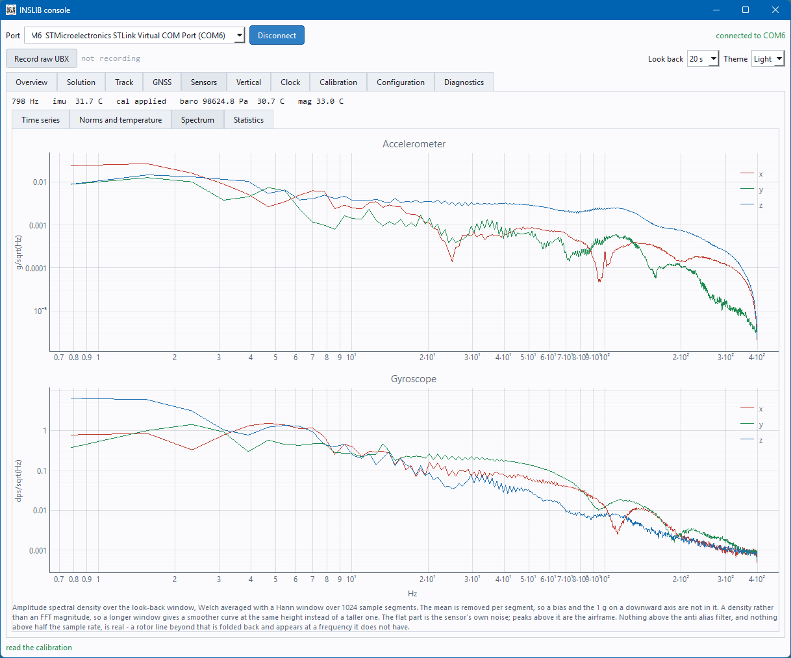

### Reference Board Command Line Tools

* `inslib_hub.py` Stream, forward and log input data from reference board
* `inslib_convert_ubx_to_csv.py` Convert reference board to `.csv` files
* `inslib_imu_calib.py` Command line IMU-calibration tool (live, or offline from any IMU's `.csv` log with `--csv`)
* `inslib_cfg.py` Reference board config read/write
* `inslib_clock_error.py` Estimate MCU-clock error from reference board `.csv` log
* `inslib_obd_speed.py` Stream car velocity from OBD-II dongle

## Common Pitfalls

IMU sensor processing is unforgiving: it is not enough to get one thing
right, the whole chain (timestamps, axis conventions, calibration,
filtering, etc.) has to line up properly. A list of common mistakes:

* **Magnetometer not calibrated** (the classic). Uncorrected hard-/soft-iron
  bias means wrong yaw, use the [calibration
  GUI](#reference-board-calibration-gui) or the command line tool
  `inslib_imu_calib.py` with `.csv` data.
* **IMU calibrated on a magnetic surface**: the [calibration
  GUI](#reference-board-calibration-gui) fits the magnetometer from the same
  session of static poses as the IMU, not a separate one.
  A metal-legged table, or nearby gadgets/laptop biases the field it reads -
  a genuinely non-magnetic and stable calibration environment is harder to find
  than it sounds. For a UAV this does not apply: calibrate the
  magnetometer already mounted in the airframe, at its final position.
* **Accelerometer/gyroscope PSD and bias random walk not measured on the
  target sensor and environment** (classic as well): either not measured at all
  (random defaults), or measured in a non-representative setting (e.g.  an
  office room, without the real vibration/thermal environment) - both make the
  filter over- or under-confident in the IMU.
* **GNSS reception too poor** INSLIB expects good GNSS data. Indoors or under
  heavy multipath, the library auto-init will reject the GNSS data. A
  high-quality GNSS receiver with a matching high-quality antenna is a must.
* **GNSS receiver not configured** There are countless ways to misconfigure
  a GNSS receiver. A working configuration for u-blox F9P and X20 receivers
  can be found [here (F9P)](python/f9p_config.py) and [here (X20)](python/x20p_config.py).
* **Timestamps not synchronized or not monotonic** every sensor needs to be
  aligned to a single monotonic timebase (`t_us`). Clock issues break the
  library.
* **GNSS antenna lever arm not set**: the offset between IMU and GNSS antenna
  (`gnss: leverarm_frd`) has an impact on position and attitude,
  especially during dynamic turns.
* **IMU and magnetometer axes not in the same body frame**: INSLIB expects
  one consistent FRD body frame for every sensor (see
  [coding_style.md](coding_style.md)), mismatched coordinate frames will produce nonsense outputs.
* **GNSS latency not measured**: a guessed `gnss: delay_ms` biases position
  during dynamic motion, see [GNSS Latency
  Estimation](#gnss-latency-estimation).
* **Unexpected height source with GNSS + barometer**: with both connected, the
  filter prefers the barometer for height by default (it keeps
  working through a GNSS outage). Set `baro_height_disable: 1` in
  `config.yaml` to force GNSS/local-position height instead.
* **No anti-aliasing/low-pass filtering on a vibrating IMU**: rotor or
  engine vibration aliases into the accelerometer/gyroscope band and breaks
  the noise model and introduce ghost accelerations. Must be filtered out before the data reaches INSLIB.
* **Sensor data over-filtered**: heavy internal/firmware smoothing adds
  its own latency.
* **IMU not calibrated over its operating temperature range**: bias/scale
  drift with temperature directly leaks into the solution. Generally
  the sensor should be in a temperature stable environment.
* **Weak sensors**: not every low-cost sensor is good enough.
* **Insufficient motion excitation for yaw observability** without turns
  (or magnetometer/GNSS-compass aiding), heading might not be reliable.

## AI Use

* The core library (`src/`) and the `KFCore` library is designed and written by a human with 20 years of experience in this field
* This `README.md` is written by a human
* The realworld datasets are collected, analyzed and tested by a human
* The code is extended and improved by Claude Opus and Sonnet, doxygen comments are improved and added
* Code and comments written by Claude are reviewed by a human (no auto-commit)
* `insrcv` is largely written by Claude
* Unit tests, the build system and the Python GUI tools are basically written 100% by Claude
* Every commit is reviewed by a human

## References

* J. Wendel, *Integrierte Navigationssysteme: Sensordatenfusion, GPS und Inertiale Navigation*, 2nd ed., Oldenbourg, 2011.
* D. H. Titterton and J. L. Weston, *Strapdown Inertial Navigation Technology*, 2nd ed., IET, 2004.
* G. J. Bierman, *Factorization Methods for Discrete Sequential Estimation*, Academic Press, 1977.
* M. S. Grewal and A. P. Andrews, *Kalman Filtering: Theory and Practice Using MATLAB*, 4th ed., Wiley, 2015.
* G. Chang, "Robust Kalman filtering based on Mahalanobis distance as outlier judging criterion," *Journal of Geodesy*, vol. 88, no. 4, pp. 391-401, 2014.
* P. D. Groves, *Principles of GNSS, Inertial, and Multisensor Integrated Navigation Systems*, 2nd ed., Artech House, 2013.
* J. R. Carpenter and C. N. D'Souza, *Navigation Filter Best Practices*, NASA/TP-2018-219822, NF1676L-29886, 2018. [PDF](https://ntrs.nasa.gov/api/citations/20180003657/downloads/20180003657.pdf)
* J. Zwiener, *Robuste Zustandsschätzung zur Navigation und Regelung autonomer und bemannter Multikopter mit verteilten Sensoren*, Schriftenreihe der Fachrichtung Geodäsie, Fachbereich Bau- und Umweltingenieurwissenschaften, Technische Universität Darmstadt, ISBN 978-3-935631-43-3, Heft 54, Darmstadt, 2019.

## Citation

If you use INSLIB in academic work, please cite it (see [`CITATION.cff`](CITATION.cff),
also picked up by GitHub's "Cite this repository" button):

```bibtex
@software{zwiener_inslib,
  author = {Zwiener, Jan},
  title  = {{INSLIB: A Portable C Library for 3D Navigation State Estimation}},
  url    = {https://github.com/jnz/INSLIB},
  year   = {2026}
}
```
